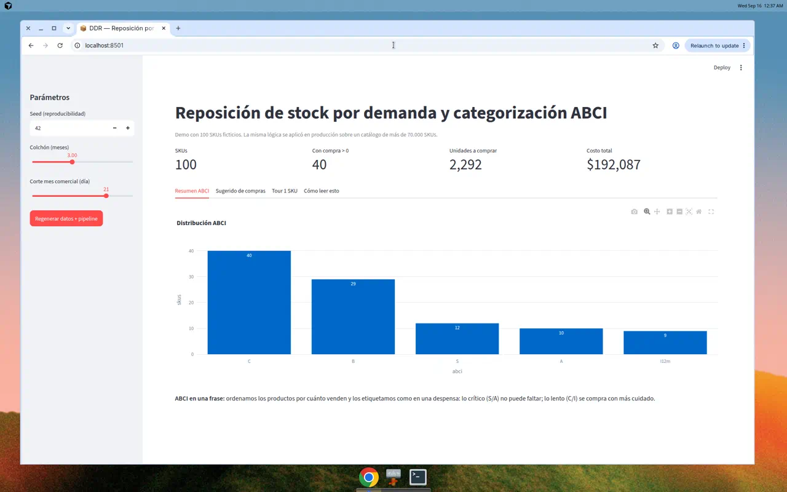
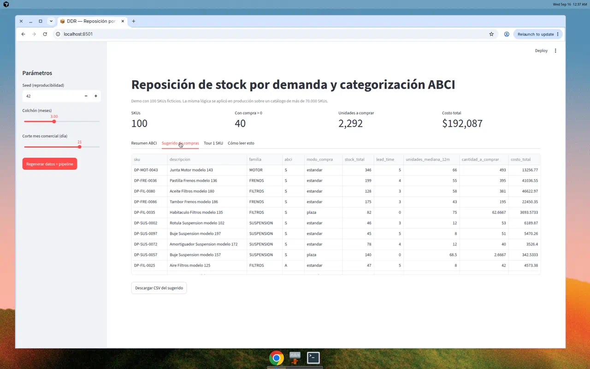
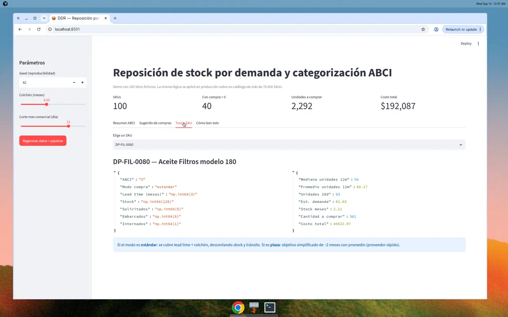

# Demand-Driven Replenishment

**Motor de reposición de stock basado en demanda y categorización ABCI**

Demo pública con **100 SKUs ficticios**, 3 locales y 12 meses de historia.  
La misma lógica se aplicó en un entorno real de control de gestión / supply chain sobre un catálogo de **más de 70.000 SKUs** (datos y nombres de esa empresa no están aquí por confidencialidad).

[](#requisitos)
[](docs/como-desplegar-streamlit.md)

---

## Problema → solución

| Problema | Solución en este repo |
|---|---|
| Catálogo grande: no se puede decidir a ojo | Pipeline que resume demanda por SKU |
| No todo el inventario importa igual | Clasificación **ABCI** (Pareto + inactivos) |
| Pedir de más / de menos cuesta plata | **Sugerido de compras** con lead time, stock y tránsito |
| Hay que explicar el “por qué” | Docs y tour de 1 SKU “con peras y manzanas” |

---

## Qué demuestra (para CV)

- Traducir reglas de negocio de reposición a código Python testeable
- Pandas a escala de portafolio (en producción: decenas de miles de SKUs)
- Jupyter como interfaz de análisis + módulos `src/` reutilizables
- Dashboard Streamlit + exports Excel
- Documentación clara para no-técnicos y reclutadores

---

## Arquitectura (30 segundos)

```text
Datos sintéticos → KPIs (28d/6m/12m) → ABCI → Cantidad a comprar → Excel + Streamlit
```

Detalle: [docs/arquitectura.md](docs/arquitectura.md) · Glosario: [docs/glosario.md](docs/glosario.md) · Tour numérico: [docs/tour-un-sku.md](docs/tour-un-sku.md)

---

## Cómo correr (< 10 minutos)

```bash
git clone https://github.com/ravannax/demand-driven-replenishment.git
cd demand-driven-replenishment
python -m venv .venv
source .venv/bin/activate  # Windows: .venv\Scripts\activate
pip install -r requirements.txt

# 1) Datos ficticios (seed=42 → siempre los mismos)
python -m src.generate_synthetic

# 2) Pipeline de sugerido de compras
python -m src.pipeline

# 3) Tests de fórmulas
pytest -q

# 4) Dashboard
streamlit run app/streamlit_app.py
```

Salidas en `output/sugerido_compras.xlsx` y `output/resumen.xlsx`.

> **Primera publicación:** si el repo aún no existe en GitHub, sigue [docs/PUBLICAR.md](docs/PUBLICAR.md).

### Vista previa del dashboard







### Notebooks

| Notebook | Para qué |
|---|---|
| `notebooks/01_generar_datos.ipynb` | Crear el dataset sintético |
| `notebooks/02_pipeline_reposicion.ipynb` | Pipeline completo SC |
| `notebooks/03_abci_explicado.ipynb` | ABCI con analogía de despensa |
| `notebooks/04_tour_un_sku.ipynb` | Un SKU de punta a punta |
| `notebooks/05_clustering_semantico.ipynb` | Extra: agrupar descripciones (sklearn) |

---

## Idea de la fórmula (estándar)

\[
\begin{aligned}
\text{stock\_ajustado} &= \text{stock} + \text{internados} - \text{demanda} \times \text{lead} \\
\text{cantidad} &= \max\bigl(0,\ \text{demanda}\times(\text{lead}+3) - \text{stock\_ajustado} - \text{solicitados} - \text{embarcados}\bigr)
\end{aligned}
\]

Proveedores “plaza” (reposición rápida): objetivo ≈ 2 meses con **promedio**, no mediana.

---

## Datos

- 100% sintéticos; seed fijo para reproducibilidad.
- Ningún código, precio, stock o demanda real.
- Empresa demo genérica: **DemoParts Distribución** (ficticia).

---

## Deploy de la demo

Ver [docs/como-desplegar-streamlit.md](docs/como-desplegar-streamlit.md).  
Streamlit Community Cloud publica una **app clicable** a partir de este repo (el repo sigue siendo la fuente del código).

---

## Estructura

```text
demand-driven-replenishment/
├── app/streamlit_app.py
├── notebooks/
├── src/           # lógica testeable
├── tests/
├── docs/
├── data/synthetic/
└── output/
```

---

## Licencia

MIT — úsalo, adáptalo, cítalo en tu portafolio si te sirve de plantilla.
